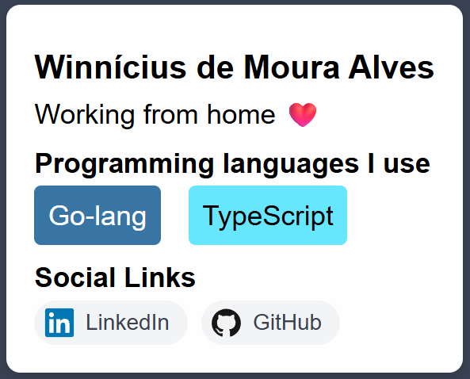

# Tickets — Galeria de TecInfo (13/04/2026)

> **Contexto da atividade:** Simulação de um fluxo real de contribuição open source. Você receberá o design de referência e as especificações técnicas do componente e deverá implementá-lo do zero. O arquivo produzido será submetido a uma API de análise automatizada que avaliará a qualidade e a conformidade do HTML e CSS produzido, retornando um feedback com pontuação e pontos de melhoria.

---

### [Feature] - Galeria de Contribuidores - Implementar cartão de perfil pessoal em HTML e CSS

#### Contexto (User Story)

Como contribuidor(a) do projeto da galeria,  
Eu quero implementar meu cartão de perfil pessoal em HTML e CSS seguindo o design e as especificações do projeto,  
Para que meu perfil seja exibido corretamente na galeria e aprovado pela análise automatizada de qualidade de código.

---

#### Design de Referência

O layout abaixo é o resultado esperado do componente. Sua implementação deve reproduzi-lo fielmente.

> `galery/card-preview.png`



O cartão é composto por quatro blocos visuais na ordem apresentada:

1. **Nome de usuário** — exibido como título principal em negrito.
2. **Bio** — parágrafo curto abaixo do nome (campo opcional).
3. **Linguagens** — título de seção seguido de badges coloridos lado a lado.
4. **Links sociais** — título de seção seguido de links em formato de pílula, cada um com ícone à esquerda e o nome da rede à direita.

---

#### Especificação Técnica

O arquivo deve se chamar `article.html` e conter dois blocos principais: o **HTML do componente** e os **estilos CSS** dentro de uma tag `<style>`.

**Estrutura HTML — elementos obrigatórios e ordem:**

| Ordem | Elemento | Classe / Atributo | Conteúdo |
|---|---|---|---|
| 1 | `<article>` | — | Elemento raiz; envolve todo o componente |
| 2 | `<h3>` | — | Seu nome de usuário |
| 3 | `<p>` | — | Sua bio (opcional) |
| 4 | `<h4>` | — | Texto exato: `Programming languages I use` |
| 5 | `<section>` | `class="container"` | Agrupa os badges de linguagem |
| 6 | `<div>` (repetível) | `class="badge"` | Nome da linguagem; cor via `style` inline |
| 7 | `<h4>` | — | Texto exato: `Social Links` |
| 8 | `<section>` | `class="social-container"` | Agrupa os links sociais |
| 9 | `<a>` (repetível) | `class="social-link"` | Link da rede social com `href` e `target="_blank"` |
| 10 | `` (dentro de cada `<a>`) | `class="social-icon"` | Ícone via CDN do Devicons |

**Estilos CSS — o que cada parte do design exige:**

Analise o design de referência e pense em cada decisão de estilo antes de escrever. As orientações abaixo descrevem o comportamento visual esperado; cabe a você traduzir isso em CSS.

**`body`**
A fonte do cartão deve ser da família sans-serif genérica do sistema.

**`article`**
O cartão não ocupa a largura inteira da tela — ele tem uma largura máxima de `16rem` e um espaçamento interno uniforme de `1rem` entre o conteúdo e suas bordas. Visualmente ele se destaca do fundo: tem cantos arredondados com raio de `0.5rem`, cor de fundo `#fefefe` e uma sombra suave abaixo dele. A sombra deve ter deslocamento vertical de `2px`, blur de `4px` e cor `rgba(0, 0, 0, 0.1)`.

**`h3`**
O nome de usuário tem um pequeno espaço acima e abaixo, mas sem margem lateral. Observe no design que o espaçamento superior e inferior é idêntico ao dos subtítulos `h4`.

**`p`**
A bio fica imediatamente abaixo do nome, sem espaço adicional entre ela e o próximo elemento. Remova qualquer margem padrão do navegador.

**`h4`**
Os subtítulos "Programming languages I use" e "Social Links" têm um espaçamento acima ligeiramente maior do que abaixo, criando uma separação visual clara da seção anterior. Use margem: `0.6rem` acima, `0.25rem` abaixo, sem margem lateral.

**`.container`**
Os badges de linguagem ficam dispostos lado a lado em uma linha. Se não houver espaço, eles devem quebrar para a linha seguinte. O espaço entre eles deve ser de `1rem`. Pense em qual modelo de layout do CSS resolve "elementos em linha que quebram quando não cabem".

**`.badge`**
Cada badge tem uma pequena área interna ao redor do texto (`0.5rem`) e cantos levemente arredondados (`0.25rem`). A cor de fundo e a cor do texto são definidas diretamente no HTML via `style` inline.

**`.icon`**
Ícone genérico com largura fixa de `2rem`.

**`.social-container`**
Os links sociais seguem o mesmo modelo de layout que os badges — em linha, com quebra automática — mas com um espaço menor entre eles: `0.5rem`.

**`.social-link`**
Olhe para o design com atenção: o ícone e o texto do link ficam alinhados verticalmente no centro, lado a lado, com `0.4rem` de espaço entre eles. O link tem formato de pílula (raio de borda `999px`), fundo cinza claro (`#f3f4f6`), sem sublinhado, cor do texto `#374151`, tamanho de fonte `0.8rem`, peso `500` e padding assimétrico: `0.25rem` acima e abaixo, `0.65rem` à direita e `0.35rem` à esquerda. A transição de cor ao passar o mouse deve ser suave: `background 0.2s`.

**`.social-link:hover`**
Ao passar o mouse, o fundo escurece levemente para `#e5e7eb`. O efeito deve ser suave (veja a propriedade de transição acima).

**`.social-icon`**
O ícone dentro do link é pequeno e quadrado: `1.1rem` de largura e `1.1rem` de altura.

> A tag `<style>` deve ser posicionada **após** o fechamento do `</article>`.

---

#### Regras de Negócio

| Regra | Detalhe |
|---|---|
| Mínimo e máximo de linguagens | A `<section class="container">` deve conter **no mínimo 1 e no máximo 2** elementos `<div class="badge">`. |
| Mínimo e máximo de links sociais | A `<section class="social-container">` deve conter **no mínimo 1 e no máximo 2** elementos `<a class="social-link">`. |
| Cor dos badges | Cada `<div class="badge">` deve definir `background-color` e `color` via atributo `style` inline, com a cor oficial da linguagem escolhida. |
| Contraste legível | Use `color: white` para fundos escuros e `color: black` para fundos claros. |
| Ícones das redes sociais | Cada `<a class="social-link">` deve conter uma `` com `src` apontando para o ícone correto via CDN do Devicons. |
| `target="_blank"` | Todos os `<a class="social-link">` devem conter o atributo `target="_blank"`. |
| Nomenclatura | Os nomes de todas as classes, atributos e seletores CSS devem ser **exatamente** os especificados neste ticket. A API penaliza qualquer desvio de nomenclatura. |

---

#### Critérios de Aceite

- [ ] O arquivo se chama exatamente `article.html`.
- [ ] A tag raiz do conteúdo é `<article>` e todos os elementos filhos estão na ordem especificada.
- [ ] O `<h3>` contém o nome de usuário real do aluno.
- [ ] A tag `<p>` está presente (com ou sem conteúdo).
- [ ] Os dois `<h4>` contêm os textos **exatos** `Programming languages I use` e `Social Links`.
- [ ] Containers usam a tag `<section>` — `<section class="container">` e `<section class="social-container">`.
- [ ] A `<section class="container">` contém entre 1 e 2 `<div class="badge">` com `background-color` e `color` definidos via `style` inline.
- [ ] A `<section class="social-container">` contém entre 1 e 2 `<a class="social-link">` com `href` real (`https://`), `target="_blank"` e ``.
- [ ] A tag `<style>` está posicionada **após** o `</article>` e contém: `article`, `.badge`, `.container`, `.social-link` e `.social-icon` como seletores declarados.
- [ ] O resultado visual no navegador corresponde ao design de referência.

---

#### DoD

- [ ] Arquivo aberto diretamente no Chrome: layout correto, badges com cores das linguagens e links sociais funcionando.
- [ ] DevTools aberto (F12): sem erros no console e sem falha no carregamento dos ícones externos.
- [ ] Arquivo submetido à API de análise: feedback recebido com pontuação.
- [ ] Código revisado pelo Tech Lead (professor).

---

#### Recursos

| Recurso | Link / Caminho |
|---|---|
| Design de referência | `galery/card-preview.png` |
| CDN Devicons — busca de ícones | https://devicon.dev |
| Formato da URL do ícone | `https://cdn.jsdelivr.net/gh/devicons/devicon@latest/icons/{nome}/{nome}-original.svg` |
| Cores oficiais das linguagens | https://github.com/ozh/github-colors |

**Exemplos de URLs de ícones via Devicons CDN:**

```
Python:     .../icons/python/python-original.svg
JavaScript: .../icons/javascript/javascript-original.svg
TypeScript: .../icons/typescript/typescript-original.svg
Java:       .../icons/java/java-original.svg
C++:        .../icons/cplusplus/cplusplus-original.svg
Go:         .../icons/go/go-original.svg
Rust:       .../icons/rust/rust-original.svg
LinkedIn:   .../icons/linkedin/linkedin-original.svg
GitHub:     .../icons/github/github-original.svg
```
